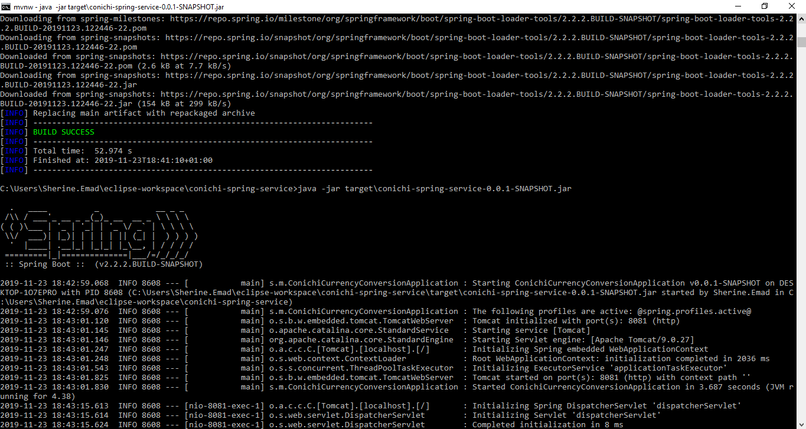
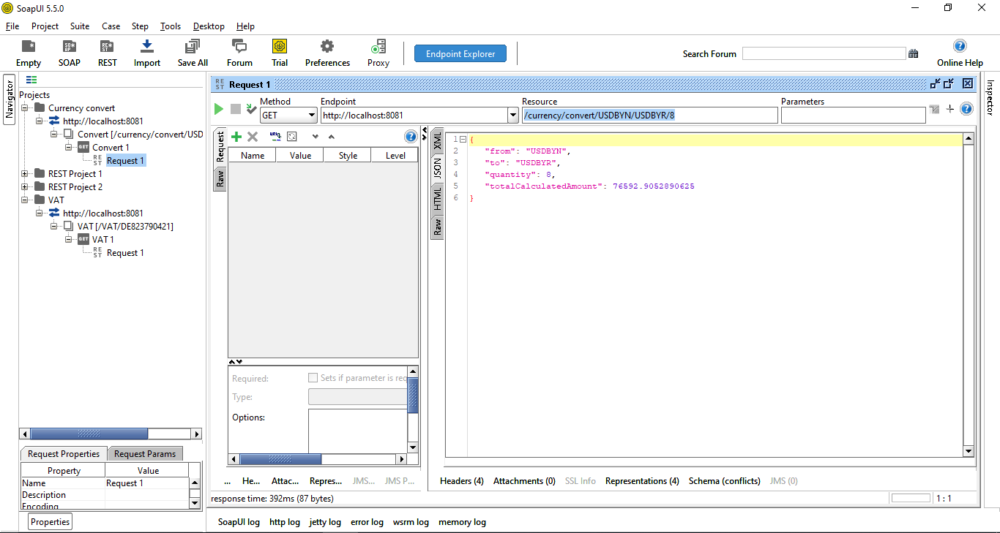
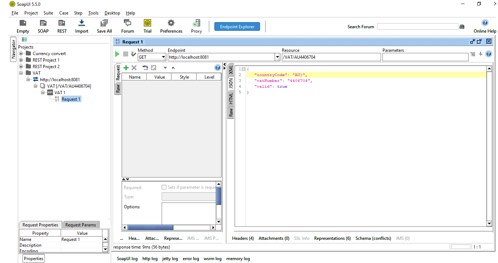
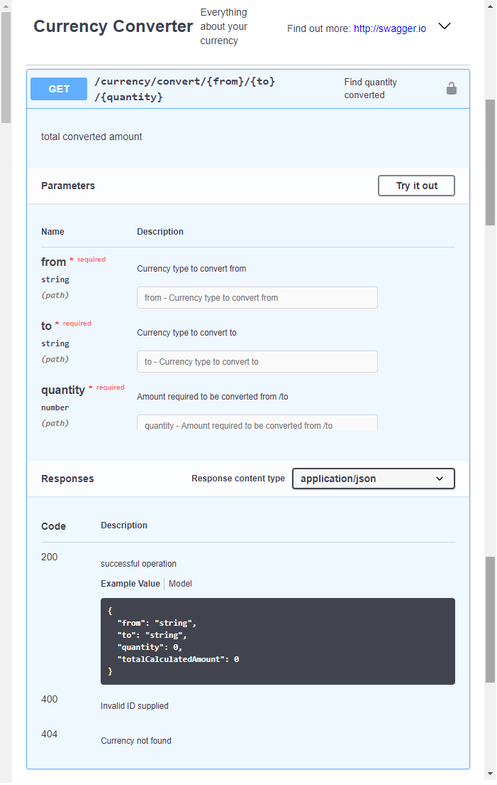
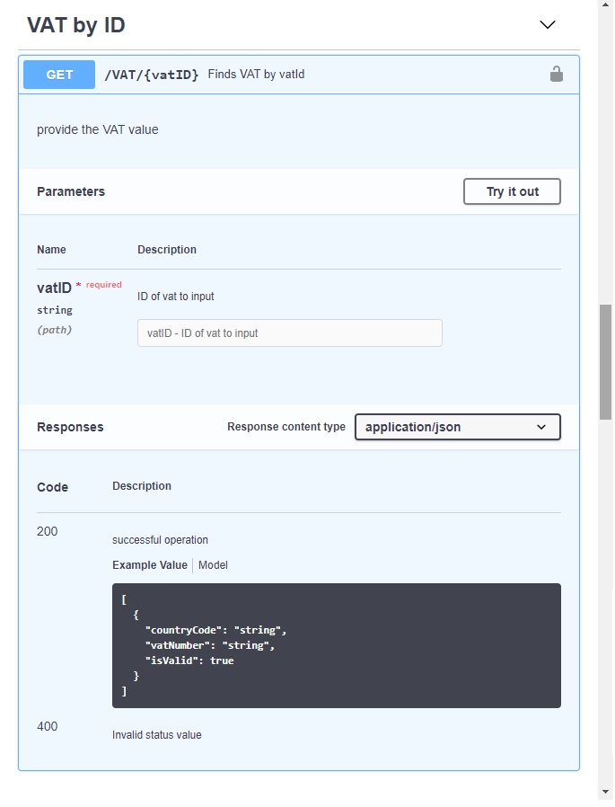

# Conichi Spring boot application serve APIs (Currency conversion/VAT validation)

-Java should be installed on the working machine to be able to run application , at least JRE.

-Run the command line to create Jar or Export from IDE in Jar Format

Running application from command line

Clean the package first
`mvnw clean package`

Run jar from command line
`java -jar target\conichi-spring-service-0.0.1-SNAPSHOT.jar`

Application is configured to run service on port 8081 as per requirement .

input to the Application
------------
Application consists of two services :

1) Currency converter service , where you can user service URL example : (http://localhost:8081/currency/convert/USDBYN/USDBYR/8) , to convert from type to another and providing quantity required to be converted

-example : from =USDBYN , to=USDBYN , quantity =8

-Soap XML project (ConichiCurrencyConversion) is attached with the resources in application in the following path : conichi-spring-service\src\main\resources\soapService

- For Currency rate i had signed for the service to retrieve actual rates per time stamp :
   [Currency layer Service](https://currencylayer.com/documentation) 
   

2) VAT validation service , where provided VAT ID is validated and return the country code and VAT number,

-Can user service URL example:
 http://localhost:8081/VAT/ITO4886070152

-example : VATID want to validate =  ITO4886070152

- For VAT values i had register in vatsense.com to retrieve right ones : 
  [VAT sense values](https://vatsense.com/)

`JavaDoc is packaged with the application to describe code details `

Output Of Application 
----------------------

Currency Conversion soap UI example 
-----------------------------------

VAT Validation soap UI example 
------------------------------

Swagger YAML file for the APIs 
------------------------------
Located in the path : conichi-spring-service\src\main\resources\swaggers

### Reference Documentation
For further reference, please consider the following sections:

* [Official Apache Maven documentation](https://maven.apache.org/guides/index.html)
* [Spring Boot Maven Plugin Reference Guide](https://docs.spring.io/spring-boot/docs/2.2.2.BUILD-SNAPSHOT/maven-plugin/)